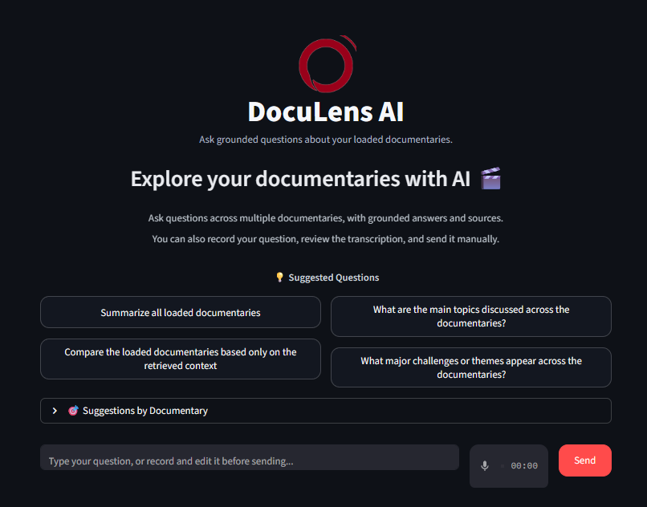
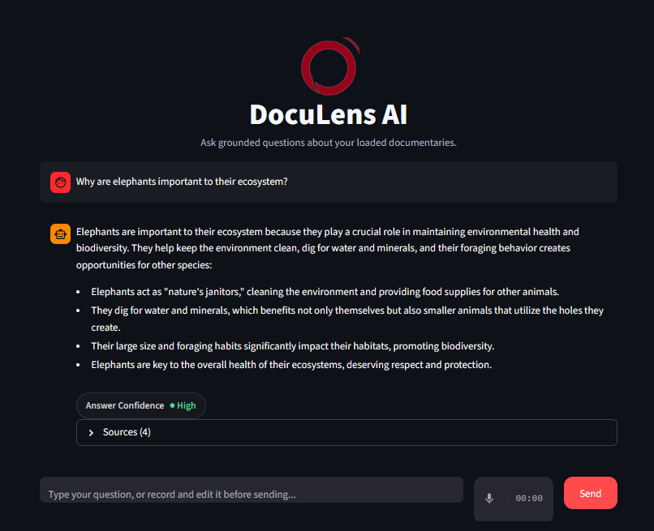
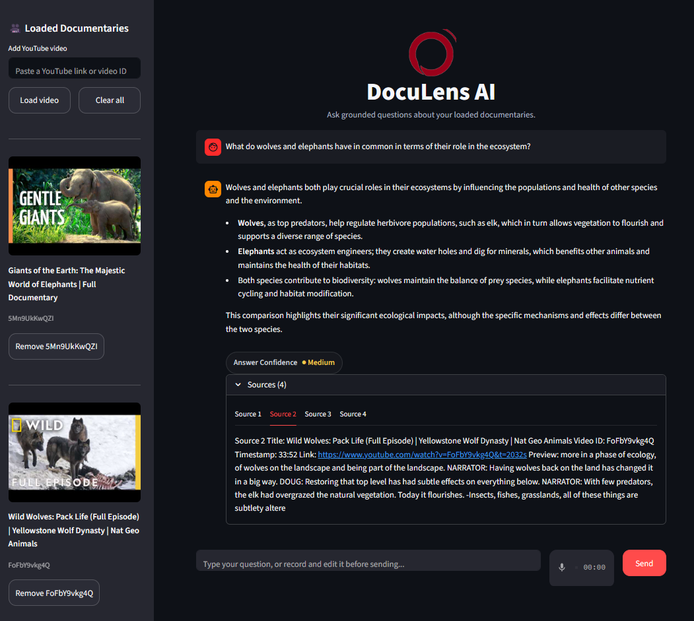

# DocuLens AI

An AI-powered chatbot that transforms documentary videos into interactive knowledge bases. Ask questions about any documentary and get intelligent answers grounded in the actual video content with direct links to specific moments.

## Demo







## Problem & Solution

Documentaries contain valuable information, but finding specific insights requires manually watching hours of footage. DocuLens AI solves this by converting transcripts into a searchable knowledge base using semantic search and retrieval-augmented generation.

## Features

- Multi-Video Support: Load and query multiple documentaries simultaneously
- Documentary Q&A: Ask questions and receive contextual answers based on transcript content
- Semantic Search: Vector embeddings enable meaning-based search, not just keywords
- Timestamp Linking: Direct links to specific video moments referenced in answers
- Source Transparency: View exact transcript segments with timestamps
- Retrieval-Augmented Generation: Answers grounded in actual content, reducing hallucinations
- Interactive Chat Interface: Streamlit-based UI for seamless interaction
- Speech Recognition: Voice input integration for hands-free querying
- LangSmith Integration: Production monitoring and tracing for quality assurance
- Conversation Memory: Multi-turn dialogue with context retention

## Tech Stack

- Language: Python 3.8+
- LLM: OpenAI API (GPT-4o-mini)
- Embeddings: OpenAI Embeddings
- Framework: Streamlit
- RAG Pipeline: LangChain with Agent Tools
- Vector Database: Chroma
- Speech Recognition: Whisper API
- Monitoring: LangSmith
- Data Source: YouTube Transcript API

## Installation

1. Clone the repository:
```bash
git clone https://github.com/yourusername/doculens-ai.git
cd doculens-ai
```

2. Create virtual environment:
```bash
python -m venv venv
source venv/bin/activate  # Windows: venv\Scripts\activate
```

3. Install dependencies:
```bash
pip install -r requirements.txt
```

4. Create `.env` file in root directory:
```
OPENAI_API_KEY=your_api_key_here
LANGSMITH_API_KEY=your_langsmith_key
```

## Usage

Start the Streamlit app:
```bash
streamlit run app.py
```

Open `http://localhost:8501` in your browser. Paste a YouTube documentary URL with captions enabled, then ask questions about the content using text or voice input. Answers include direct timestamp links to relevant video segments.

## Example Questions

- "What challenges do elephants face in the wild?"
- "Why are whales important to ocean ecosystems?"
- "How do dolphins communicate with each other?"

## How It Works

1. Extract transcript from YouTube with timestamp data
2. Split transcript into contextual chunks
3. Convert chunks to vector embeddings using OpenAI
4. Store embeddings in Chroma vector database
5. User question converted to embedding and searched in database
6. Retrieved context sent to LLM for answer generation
7. Responses include timestamp links to video moments
8. LangSmith tracks all interactions for monitoring and optimization

## Project Structure
```
doculens-ai/
├── app.py                # Main Streamlit application
├── src/
│   ├── agent_chatbot.py       # LangChain agent with tools
│   ├── chatbot.py             # Core chatbot functionality
│   ├── retriever.py           # Retrieval system for context
│   ├── transcript_loader.py   # YouTube transcript extraction
│   ├── text_splitter.py       # Chunking strategy
│   ├── video_tools.py         # Multi-video management
│   ├── vector_db.py           # Vector database operations
│   └── __init__.py
├── data/                       # Processed documentary data
├── transcripts/               # Cached transcript JSON files
├── vectorstore/               # Chroma vector store persistence
├── requirements.txt           # Python dependencies
├── .env                       # API keys (not committed)
├── .gitignore
├── LICENSE
└── README.md
```

## Requirements

See `requirements.txt` for complete dependencies including:
- openai
- langchain
- streamlit
- youtube-transcript-api
- chroma-db
- python-dotenv
- langsmith

## Limitations

- Requires YouTube videos with captions enabled
- Answer quality depends on transcript accuracy and completeness
- OpenAI API costs apply for embeddings and LLM usage
- Optimized for English documentaries

## Deployment

The application is deployed using Streamlit Cloud and includes:
- Persistent vector database storage
- Multi-video knowledge base management
- Real-time transcript processing
- Speech input capabilities
- Production monitoring via LangSmith

## Project Context

Built as a demonstration of production-grade retrieval-augmented generation and LLM integration for real-world applications. Showcases ability to architect and deploy end-to-end AI systems with multi-source data integration, semantic search, speech recognition, and conversational interfaces.

## Author

Edwin Alexis Santiago Rodríguez
- AI Engineering Professional
- GitHub: [github.com/yourusername](https://github.com/EdwinSanti)
- LinkedIn: [linkedin.com/in/yourprofile](https://www.linkedin.com/in/edwin-santiago-rodr%C3%ADguez-8a520731a/)

## License

MIT License - see LICENSE file for details